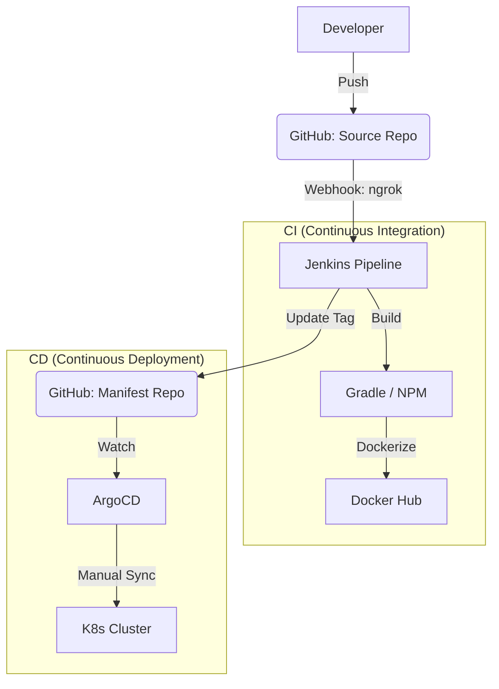

# 02. DevOps & Deployment (데브옵스 및 배포)

이 문서는 MapLog 프로젝트의 CI/CD 파이프라인과 Kubernetes 인프라 구조를 설명합니다.

## 1. CI/CD 파이프라인 아키텍처
MapLog는 Jenkins와 ArgoCD를 결합한 **GitOps** 배포 모델을 따릅니다.



## 2. Jenkins Pipeline (CI)
`Jenkinsfile`에 정의된 파이프라인은 다음 스테이지를 수행합니다.
1. **Checkout:** 소스 코드 및 매니페스트 레포지토리 체크아웃.
2. **Source Build:** Java(Gradle) JAR 생성 및 Vue(Vite) 정적 자산 빌드.
   - *특이사항:* 프론트엔드 빌드 시 Jenkins Credentials에서 카카오 맵 키를 동적으로 주입.
3. **Container Build:** Dockerfile을 이용해 이미지를 생성하고 빌드 번호(`${BUILD_NUMBER}`)로 태깅.
4. **Push:** Docker Hub(`gusgh07`)로 이미지 업로드.
5. **Update Manifest:** `k8s-manifests` 레포지토리의 `deployment.yaml` 내 이미지 태그를 최신화.

## 3. Jenkins 환경 설정 가이드 (Configuration Guide)
Jenkins 파이프라인이 정상적으로 작동하기 위해 필요한 **Credentials**와 **Tools** 설정입니다.

### 3.1. Credentials 설정 (Manage Credentials)
Jenkins 관리 > Manage Credentials에서 다음 ID로 자격 증명을 등록해야 합니다.

| Credential ID | 종류 (Kind) | 설명 |
| :--- | :--- | :--- |
| `github` | Username with password | GitHub 소스 및 매니페스트 레포지토리 접근 권한 (PAT 사용 권장) |
| `DOCKERHUB_PASSWORD` | Username with password | Docker Hub 이미지 푸시를 위한 계정 정보 |
| `KAKAO_MAP_KEY` | Secret text | 프론트엔드 빌드 시 주입할 카카오 맵 API 키 |
| `discord` | Secret text | 빌드 결과 알림을 위한 Discord Webhook URL |

### 3.2. Global Tool Configuration 설정
Jenkins 관리 > Global Tool Configuration에서 다음 도구들의 이름을 `Jenkinsfile` 정의와 일치시켜야 합니다.

- **JDK (jdk-21):** Java 21 버전을 설치하고 이름을 `openJDK21`로 설정합니다.
- **Gradle (gradle):** 최신 Gradle 버전을 설치하고 이름을 `gradle`로 설정합니다.
- **NodeJS:** 프론트엔드 빌드를 위해 Node.js 20 이상의 버전을 설치합니다. (서버 환경에 사전 설치되거나 Jenkins 플러그인으로 관리)
- **Docker:** Docker 빌드가 가능한 환경이어야 하며, Jenkins 사용자가 Docker 그룹에 포함되어야 합니다.

## 4. ArgoCD 배포 전략 (CD)
현재 ArgoCD의 Sync Policy는 **Manual(수동)**로 설정되어 있습니다.

### 4.1. ArgoCD 대시보드 접속 방법 (Dashboard Access)
보안상 외부로 노출되지 않은 ArgoCD 서버에 접속하기 위해 `kubectl port-forward`를 사용하여 로컬 환경과 연결합니다.

1. **터미널에서 포트 포워딩 실행:**
   ```powershell
   kubectl port-forward svc/argocd-server -n argocd 8888:443
   ```
   *   해당 명령어는 터미널을 열어둔 상태로 유지해야 연결이 지속됩니다.
2. **브라우저 접속:**
   - 주소창에 `https://localhost:8888` 입력.
   - 보안 경고 발생 시 '고급' -> 'localhost(안전하지 않음)로 이동' 클릭.
3. **로그인 정보:**
   - **ID:** `admin`
   - **Password:** 설치 시 생성된 초기 비밀번호 (보통 `argocd-initial-admin-secret`에서 확인 가능).

### 4.2. ArgoCD 애플리케이션 생성 가이드 (Application Setup)
ArgoCD 웹 UI에서 새로운 앱을 추가하는 상세 설정 값입니다.

1. **"+ NEW APP"** 클릭 후 다음 정보를 입력합니다.
2. **GENERAL**:
   - **Application Name**: `map-log`
   - **Project Name**: `default`
   - **Sync Policy**: `Manual` (권장) 또는 `Automatic`
3. **SOURCE**:
   - **Repository URL**: `https://github.com/gusgh075/k8s-manifests.git`
   - **Revision**: `main`
   - **Path**: `.`
4. **DESTINATION**:
   - **Cluster URL**: `https://kubernetes.default.svc`
   - **Namespace**: `default`
5. 설정 완료 후 **"CREATE"** 버튼을 눌러 생성하고, 생성된 앱 카드에서 **"SYNC"**를 클릭하여 배포를 완료합니다.

### 4.3. Private 레포지토리 연동 (Private Repository Connection)
`k8s-manifests` 레포지토리가 Private인 경우, ArgoCD가 접근할 수 있도록 GitHub Personal Access Token(PAT)을 등록해야 합니다.

1. **GitHub PAT 발급**: GitHub Settings > Developer settings > Personal access tokens (Tokens classic)에서 `repo` 권한을 가진 토큰을 생성합니다.
2. **ArgoCD 레포지토리 등록**:
   - ArgoCD 메뉴 > **Settings** > **Repositories** 클릭.
   - **"+ CONNECT REPO"** 버튼 클릭.
   - **Choose connection method**: `VIA HTTPS` 선택.
   - **Repository URL**: `https://github.com/gusgh075/k8s-manifests.git`
   - **Username**: GitHub 계정 ID 입력.
   - **Password**: 발급받은 **PAT(토큰값)** 입력.
3. **연결 확인**: Status가 `Successful`로 표시되는지 확인합니다.

## 5. 네트워크 및 도메인 배포 (ngrok)
로컬 K8s 환경의 외부 노출 한계를 극복하기 위해 **ngrok**을 활용합니다.
- **Webhook 수신:** GitHub의 Push 이벤트를 Jenkins가 받을 수 있도록 ngrok 터널을 통해 Jenkins 포트를 외부에 노출합니다.
- **서비스 배포:** 현재는 Ingress를 통해 80포트로 서비스를 노출하며, 필요 시 ngrok을 통해 해당 도메인을 퍼블릭 URL로 연동하여 외부에서 접근 가능하게 구성합니다.

## 6. 웹 배포 절차 (Web Deployment)
프로젝트를 실제 웹에 배포하는 표준 절차는 다음과 같습니다.
1. **Ingress 설정:** `ingress.yaml`을 통해 서비스 도메인과 경로를 정의합니다.
2. **ngrok 터널링:**
   ```bash
   ngrok http 80
   ```
   실행 후 생성된 `https://<random>.ngrok-free.app` 주소를 통해 외부 접근이 가능해집니다.
3. **ArgoCD Sync:** Git의 최신 상태와 클러스터 상태를 동기화하여 실배포를 완료합니다.
