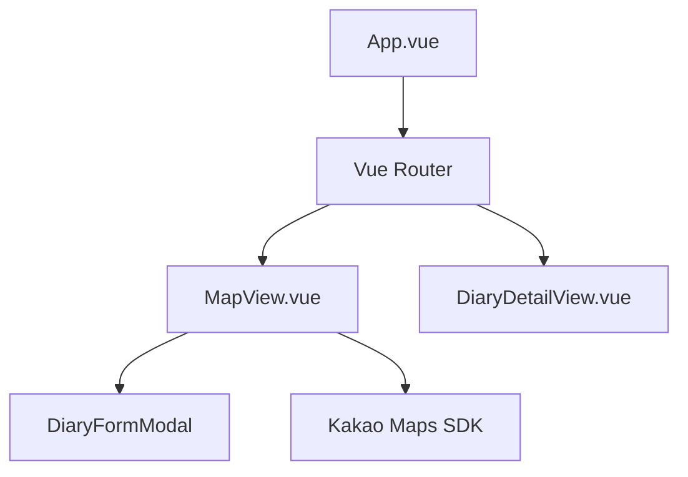

# 04. Frontend Architecture (프론트엔드 아키텍처)

Vue 3 (Composition API) 기반의 프론트엔드 구조와 주요 기술적 구현 사항을 설명합니다.

## 1. 컴포넌트 및 레이아웃 구조
프로젝트는 관심사 분리를 위해 `views`(페이지 단위)와 `components`(재사용 단위)를 구분합니다.

## 2. 상태 관리 (Pinia)
중앙 상태 관리를 위해 Pinia를 사용하며, 현재 다음 스토어들이 핵심 역할을 합니다.

- **auth.js:**
  - 사용자 인증 상태(로그인 여부) 및 프로필 정보를 관리합니다.
  - `localStorage`와 연동하여 토큰(`accessToken`, `refreshToken`)의 영속성을 유지합니다.
- **notification.js:**
  - 사용자의 실시간 알림 상태 및 읽지 않은 알림 개수를 관리하여 반응형 UI를 제공합니다.

## 3. 지도 및 위치 기반 기능
카카오 맵 연동은 별도의 래퍼 라이브러리 없이 **Native SDK를 직접 제어**하는 방식을 채택했습니다.

- **구현 방식:** `MapView.vue`에서 `window.kakao` 객체를 직접 조작하여 지도를 초기화하고 마커를 렌더링합니다.
- **동적 로딩:** 사용자가 지도를 클릭할 때 좌표를 추출하고, 해당 위치에 일기를 작성할 수 있는 모달을 연동합니다.
- **최적화:** 지도 영역 변경(`idle` 이벤트) 시 현재 화면 내의 마커만 서버에서 가져오도록 구현되어 있습니다.

## 4. API 통신 및 유지보수 전략 (Axios)
유지보수 효율을 높이기 위해 API 계층을 리팩토링했습니다.

- **중앙 제어:** `api/axios.js`에서 공통 `baseURL`과 인터셉터를 관리합니다.
- **경로 분리:** 각 도메인 API 파일(`user.js`, `diary.js` 등)에서는 `/api` 접두사를 제거하고 자원 경로만 관리합니다.
- **환경 변수 결합:** 빌드 시 주입되는 `VITE_API_BASE_URL`과 결합되어 최종 요청 경로가 결정됩니다.
- **자동 토큰 갱신:** 응답 인터셉터가 401 에러를 감지하면 `refreshToken`을 사용하여 자동으로 새 토큰을 발급받고 실패한 요청을 재시도합니다.
